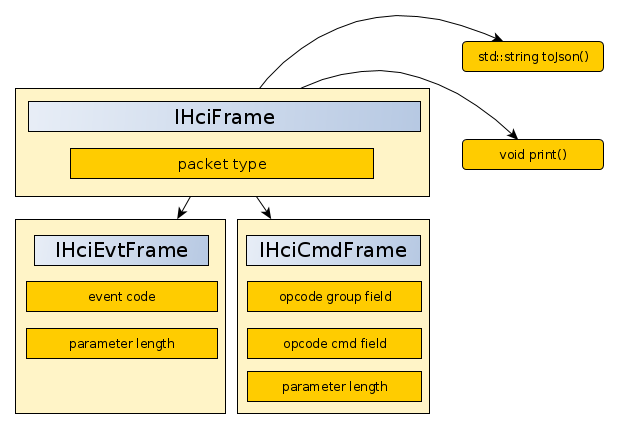
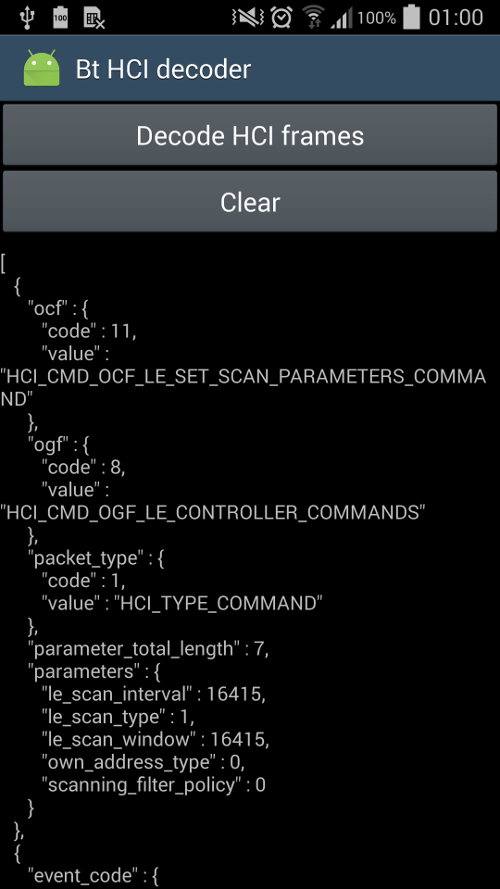

# Bluetooth HCI decoder library #

[](https://travis-ci.org/akinaru/bluetooth-hci-decoder)
[ ](https://bintray.com/akinaru/generic/bluetooth-hci-decoder/_latestVersion)
[](LICENSE.md)

Lightweight Bluetooth HCI decoder library parsing individually HCI frames into JSON format

<a href="CHANGELOG.md">ChangeLogs can be found here</a>

## Documentation

http://akinaru.github.io/bluetooth-hci-decoder

## Setup & Build

```
git submodule init
git submodule update
cmake .
make
```

library release is located under `lib` directory.

## Test

A small test program is provided extracting HCI frames from a btsnoop file decoded with https://github.com/akinaru/btsnoop-decoder

Syntax : ``./bthci-test <btsnoop_file>``

```
./bin/bthci-test ./snoop_files/btsnoop_hci.log
```

##Decoding

###Decode frame

Input should be a single HCI frame in `std::vector<char> packet` format

Instanciate a `HciDecoder` class and call `IHciFrame* decode(std::vector<char> packet);` :

```
HciDecoder hci_decoder;

IHciFrame * frame = hci_decoder.decode(packet);

```

<i>`IHciFrame * frame` can be null if HCI frame is not currently supported</i>

### Architecture



###List of HCI frames

You can retrieve full list of `IHciFrame` decoded with a single `HciDecoder` with `std::vector<IHciFrame*> getFrameList()` method : 

```
std::vector<IHciFrame*> frame_list = hci_decoder.getFrameList();

for (unsigned int i = 0; i  < frame_list.size();i++){
	frame_list.at(i)->print();
}
```

###Complete HCI frame list in JSON array

To convert all HCI frames previously decoded to json array format, use `std::string toJson(bool beautify)` :

```
std::string json_array_list = hci_decoder.toJson(false);

```
<i>`beautify` to `true` will insert indentation and linefeed to string output</i>

##JSON output format

Common fields for all HCI frames :

* packet_type
* parameters

<table>
	<tr>
			<th>field name</th>
			<th>subfield name</th>
			<th>type</th>
			<th>description</th>
	</tr>
	<tr>
			<td rowspan="2">packet_type</td>
			<td>code</td>
			<td>int</td>
			<td>hci packet type numeric value</td>
	</tr>
	<tr>
			<td>value</td>
			<td>string</td>
			<td>hci packet type string value</td>
	</tr>
	<tr>
			<td>parameters</td>
			<td></td>
			<td>json object</td>
			<td>parameters items</td>
	</tr>
</table>

###Event

Common fields for all HCI Event frames:

* event_code
* parameter_total_length
* subevent_code (for subevent)

<table>
	<tr>
			<th>field name</th>
			<th>subfield name</th>
			<th>type</th>
			<th>description</th>
	</tr>
	<tr>
			<td rowspan="2">event_code</td>
			<td>code</td>
			<td>int</td>
			<td>event numeric value</td>
	</tr>
	<tr>
			<td>value</td>
			<td>string</td>
			<td>event string value</td>
	</tr>
	<tr>
			<td>parameter_total_length</td>
			<td></td>
			<td>int</td>
			<td>total length of parameters</td>
	</tr>
	<tr>
			<td rowspan="2">subevent_code</td>
			<td>code</td>
			<td>int</td>
			<td>subevent numeric value</td>
	</tr>
	<tr>
			<td>value</td>
			<td>string</td>
			<td>subevent string value</td>
	</tr>
</table>

Example :

```
{
	"event_code" : {
		 "code" : 14,
		 "value" : "HCI_EVENT_COMMAND_COMPLETE"
	},
	"packet_type" : {
		 "code" : 4,
		 "value" : "HCI_TYPE_EVENT"
	},
	"parameter_total_length" : 4,
	"parameters" : {
		 "command_opcode" : {
				"ocf" : {
					 "code" : 26,
					 "value" : "HCI_CMD_OCF_CTRL_BSB_WRITE_SCAN_ENABLE_COMMAND"
				},
				"ogf" : {
					 "code" : 3,
					 "value" : "HCI_CMD_OGF_CONTROLLER_BASEBAND_COMMANDS"
				}
		 },
		 "num_hci_command_packets" : 1,
		 "return_parameters" : {
				"values" : {
					 "status" : 0
				}
		 }
	}
}
```

###Command

Common fields for all HCI Command frames:

* ogf (Opcode Group field)
* ocf (Opcode Command field)

<table>
	<tr>
			<th>field name</th>
			<th>subfield name</th>
			<th>type</th>
			<th>description</th>
	</tr>
	<tr>
			<td rowspan="2">ogf</td>
			<td>code</td>
			<td>int</td>
			<td>opcode group field numeric value</td>
	</tr>
	<tr>
			<td>value</td>
			<td>string</td>
			<td>opcode group field string value</td>
	</tr>
	<tr>
			<td rowspan="2">ocf</td>
			<td>code</td>
			<td>int</td>
			<td>opcode command field numeric value</td>
	</tr>
	<tr>
			<td>value</td>
			<td>string</td>
			<td>opcode command field string value</td>
	</tr>
</table>

```
{
	"ocf" : {
		 "code" : 8,
		 "value" : "HCI_CMD_OCF_LE_SET_ADVERTISING_DATA_COMMAND"
	},
	"ogf" : {
		 "code" : 8,
		 "value" : "HCI_CMD_OGF_LE_CONTROLLER_COMMANDS"
	},
	"packet_type" : {
		 "code" : 1,
		 "value" : "HCI_TYPE_COMMAND"
	},
	"parameter_total_length" : 32,
	"parameters" : {
		 "advertising_data" : [ 2, 1, 0 ],
		 "advertising_data_length" : 3
	}
}
```
###Model & Supported Command / Events

* Packet types

| Packet type string | packet type value |
|--------------------|-------------------|
| HCI_TYPE_UNKNOWN   | 0x00              |
| HCI_TYPE_COMMAND   | 0x01              |
| HCI_TYPE_ACL_DATA  | 0x02              |
| HCI_TYPE_SCO_DATA  | 0x03              |
| HCI_TYPE_EVENT     | 0x04              |

<hr/>

* Opcode Group field

| OGF string                               | OGF value |
|--------------------|-------------------|
| HCI_CMD_OGF_LINK_CONTROl_COMMANDS        | 0x01      |
| HCI_CMD_OGF_LINK_POLICY_COMMANDS         | 0x02      |
| HCI_CMD_OGF_CONTROLLER_BASEBAND_COMMANDS | 0x03      |
| HCI_CMD_OGF_INFORMATIONAL_PARAMETERS     | 0x04      |
| HCI_CMD_OGF_STATUS_PARAMETERS            | 0x05      |
| HCI_CMD_OGF_TESTING_COMMANDS             | 0x06      |
| HCI_CMD_OGF_LE_CONTROLLER_COMMANDS       | 0x08      |
| HCI_CMD_OGF_VENDOR_SPECIFIC              | 0x3F      |

<hr/>

* Informational Command

| HCI Command string                                               | HCI command value |
|--------------------|-------------------|
| HCI_CMD_OCF_INFORMATIONAL_READ_LOCAL_SUPPORTED_COMMAND           | 0x0002 |
| HCI_CMD_OCF_INFORMATIONAL_READ_BUFFER_SIZE_COMMAND               | 0x0005 |
| HCI_CMD_OCF_INFORMATIONAL_READ_BD_ADDR                           | 0x0009 |
| HCI_CMD_OCF_INFORMATIONAL_READ_LOCAL_VERSION_INFORMATION_COMMAND | 0x0001 |
| HCI_CMD_OCF_INFORMATIONAL_READ_LOCAL_EXTENDED_FEATURES_COMMAND   | 0x0004 |

<hr/>

* Le Command

| HCI Command string                                               | HCI command value |
|--------------------|-------------------|
| HCI_CMD_OCF_LE_SET_SCAN_PARAMETERS_COMMAND                 | 0x000B |
| HCI_CMD_OCF_LE_SET_ADVERTISING_PARAMETERS_COMMAND          | 0x0006 |
| HCI_CMD_OCF_LE_SET_SCAN_ENABLE_COMMAND                     | 0x000C |
| HCI_CMD_OCF_LE_CREATE_CONNECTION_COMMAND                   | 0x000D |
| HCI_CMD_OCF_LE_CLEAR_WHITE_LIST_COMMAND                    | 0x0010 |
| HCI_CMD_OCF_LE_READ_REMOTE_USED_FEATURES_COMMAND           | 0x0016 |
| HCI_CMD_OCF_LE_READ_WHITE_LIST_SIZE_COMMAND                | 0x000F |
| HCI_CMD_OCF_LE_SET_ADVERTISING_DATA_COMMAND                | 0x0008 |
| HCI_CMD_OCF_LE_READ_BUFFER_SIZE_COMMAND                    | 0x0002 |
| HCI_CMD_OCF_LE_READ_LOCAL_SUPPORTED_FEATURES_COMMAND       | 0x0003 |
| HCI_CMD_OCF_LE_SET_EVENT_MASK_COMMAND                      | 0x0001 |
| HCI_CMD_OCF_LE_SET_RANDOM_ADDRESS_COMMAND                  | 0x0005 |
| HCI_CMD_OCF_LE_REMOVE_DEVICE_FROM_RESOLVING_LIST_COMMAND   | 0x001C |

<hr/>

  * Link Control Command

| HCI Command string                                                  | HCI command value |
|--------------------|-------------------|
| HCI_CMD_OCF_LINK_CONTROL_INQUIRY_COMMAND  | 0x0001 |
| HCI_CMD_OCF_LINK_CONTROL_INQUIRY_CANCEL_COMMAND | 0x0002 |
| HCI_CMD_OCF_LINK_CONTROL_DISCONNECT_COMMAND | 0x0006 |

<hr/>

  * Link Policy Command

| HCI Command string                                                  | HCI command value |
|--------------------|-------------------|
| HCI_CMD_OCF_LINK_POLICY_WRITE_DEFAULT_LINK_POLICY_SETTINGS_COMMAND  | 0x000F |

<hr/>

* Baseband Control Command

| HCI Command string                                               | HCI command value |
|--------------------|-------------------|
| HCI_CMD_OCF_CTRL_BSB_RESET_COMMAND                               | 0x0003 |
| HCI_CMD_OCF_CTRL_BSB_SET_EVENT_FILTER_COMMAND                    | 0x0005 |
| HCI_CMD_OCF_CTRL_BSB_WRITE_LOCAL_NAME_COMMAND                    | 0x0013 |
| HCI_CMD_OCF_CTRL_BSB_READ_LOCAL_NAME_COMMAND                     | 0x0014 |
| HCI_CMD_OCF_CTRL_BSB_READ_CLASS_OF_DEVICE_COMMAND                | 0x0023 |
| HCI_CMD_OCF_CTRL_BSB_WRITE_CLASS_OF_DEVICE_COMMAND               | 0x0024 |
| HCI_CMD_OCF_CTRL_BSB_READ_INQUIRY_MODE_COMMAND                   | 0x0044 |
| HCI_CMD_OCF_CTRL_BSB_WRITE_INQUIRY_MODE_COMMAND                  | 0x0045 |
| HCI_CMD_OCF_CTRL_BSB_READ_LE_HOST_SUPPORT_COMMAND                | 0x006C |
| HCI_CMD_OCF_CTRL_BSB_WRITE_LE_HOST_SUPPORT_COMMAND               | 0x006D |
| HCI_CMD_OCF_CTRL_BSB_WRITE_INQUIRY_SCAN_ACTIVITY_COMMAND         | 0x001E |
| HCI_CMD_OCF_CTRL_BSB_READ_INQUIRY_SCAN_ACTIVITY_COMMAND          | 0x001D |
| HCI_CMD_OCF_CTRL_BSB_READ_VOICE_SETTING_COMMAND                  | 0x0025 |
| HCI_CMD_OCF_CTRL_BSB_WRITE_VOICE_SETTING_COMMAND                 | 0x0026 |
| HCI_CMD_OCF_CTRL_BSB_READ_CURRENT_IAC_LAP_COMMAND                | 0x0039 |
| HCI_CMD_OCF_CTRL_BSB_WRITE_CURRENT_IAC_LAP_COMMAND               | 0x003A |
| HCI_CMD_OCF_CTRL_BSB_READ_PAGE_SCAN_TYPE_COMMAND                 | 0x0046 |
| HCI_CMD_OCF_CTRL_BSB_WRITE_PAGE_SCAN_TYPE_COMMAND                | 0x0047 |
| HCI_CMD_OCF_CTRL_BSB_READ_SIMPLE_PAIRING_MODE_COMMAND            | 0x0055 |
| HCI_CMD_OCF_CTRL_BSB_WRITE_SIMPLE_PAIRING_MODE_COMMAND           | 0x0056 |
| HCI_CMD_OCF_CTRL_BSB_READ_EXTENDED_INQUIRY_RESPONSE_COMMAND      | 0x0051 |
| HCI_CMD_OCF_CTRL_BSB_WRITE_EXTENDED_INQUIRY_RESPONSE_COMMAND     | 0x0052 |
| HCI_CMD_OCF_CTRL_BSB_READ_SCAN_ENABLE_COMMAND                    | 0x0019 |
| HCI_CMD_OCF_CTRL_BSB_WRITE_SCAN_ENABLE_COMMAND                   | 0x001A |
| HCI_CMD_OCF_CTRL_BSB_READ_INQUIRY_SCAN_TYPE_COMMAND              | 0x0042 |
| HCI_CMD_OCF_CTRL_BSB_WRITE_INQUIRY_SCAN_TYPE_COMMAND             | 0x0043 |
| HCI_CMD_OCF_CTRL_BSB_SET_EVENT_MASK_COMMAND                      | 0x0001 |
| HCI_CMD_OCF_CTRL_BSB_READ_PAGE_TIMEOUT_COMMAND                   | 0x0017 |
| HCI_CMD_OCF_CTRL_BSB_WRITE_PAGE_TIMEOUT_COMMAND                  | 0x0018 |
| HCI_CMD_OCF_CTRL_BSB_HOST_BUFFER_SIZE_COMMAND                    | 0x0033 |

<hr/>

* Events

| HCI event string                                               | HCI event value |
|--------------------|-------------------|
| HCI_EVENT_COMMAND_COMPLETE   | 0x0E |
| HCI_EVENT_LE_META            | 0x3E |
| HCI_EVENT_DISCONNECTION_COMPLETE      | 0x05 |
| HCI_EVENT_NUMBER_OF_COMPLETED_PACKET  | 0x13 |
| HCI_EVENT_EXTENDED_INQUIRY_RESULT     | 0x2F |
| HCI_EVENT_INQUIRY_COMPLETE            | 0x01 |
| HCI_EVENT_COMMAND_STATUS              | 0x0F |

<hr/>

* LE subevent

| HCI subevent string                                               | HCI subevent value |
|--------------------|-------------------|
| HCI_EVENT_LE_CONNECTION_COMPLETE | 0x01 |
| HCI_EVENT_LE_ADVERTISING_REPORT  | 0x02 |
| HCI_EVENT_LE_CONNECTION_UPDATE_COMPLETE          | 0x03 |
| HCI_EVENT_LE_READ_REMOTE_USED_FEATURES_COMPLETE  | 0x04 |
| HCI_EVENT_LE_LONG_TERM_KEY_REQUEST               | 0x05 |
| HCI_EVENT_LE_REMOTE_CONNECTION_PARAMETER_REQUEST | 0x06 |
| HCI_EVENT_LE_DATA_LENGTH_CHANGE                  | 0x07 |
| HCI_EVENT_LE_READ_LOCAL_P256_PUBLIC_KEY_COMPLETE | 0x08 |
| HCI_EVENT_LE_GENERATE_DHKEY_COMPLETE             | 0x09 |
| HCI_EVENT_LE_ENHANCED_CONNECTION_COMPLETE        | 0x0A |
| HCI_EVENT_LE_DIRECT_ADVERTISING_REPORT           | 0x0B |

<hr/>

##Android integration

An example using HCI decoder library is provided in `android-example` directory.

This example will decode a snoop file extracted from raw directory, parse all HCI frames in it and display results on the screen

An update of submodule of https://github.com/akinaru/btsnoop-decoder is needed to retrieve source of btsnoop decoder project. Make sure you have done a `git submodule update` before

This is an Android Studio project which can be built with gradle :

```
cd android-example
./gradlew clean build
```



###Troubleshoot

If you dont use Android NDK rc10 in your `Android.mk` change std include with your own path in you android-ndk source :

```
LOCAL_C_INCLUDES := $NDK/sources/cxx-stl/gnu-libstdc++/4.8/include
```

<hr/>

##External library

* json encoding with jsonccp : https://github.com/open-source-parsers/jsoncpp
* for testing HCI library, bluetooth snoop decoder : https://github.com/akinaru/btsnoop-decoder

##Specifications

* Bluetooth specifications v4.2 - Volume 2 - Part E Host Controller Interface Functionnal Specification https://www.bluetooth.org
